# API-List-App
Aplicación nativa para Android desarrollada con **Kotlin** y **Jetpack Compose**. El proyecto destaca por implementar una arquitectura moderna que consume datos de una **API REST** y asegura la persistencia mediante una **base de datos local**.


## ⚠️ Aclaración sobre el contenido (API)

Este proyecto ha sido desarrollado **únicamente con fines educativos y de práctica**. 

Todos los datos, nombres, descripciones e imágenes mostrados en la aplicación se consumen directamente de la [API pública y gratuita de Rick and Morty](https://rickandmortyapi.com/). 

No soy el creador, autor ni propietario de dicho material. Cabe destacar que el universo de la serie *Rick y Morty* se caracteriza por su humor adulto, ciencia ficción absurda y personajes un tanto extravagantes. Por lo tanto, cualquier contenido, nombre o imagen inusual o "extraña" que pueda visualizarse al probar la aplicación es simplemente un reflejo directo de los datos que provee la API y de la naturaleza de la propia serie.


##  Características principales

- **Interfaz Declarativa:** Construida totalmente con Jetpack Compose para una experiencia de usuario fluida y moderna.
- **Consumo de API:** Integración de datos en tiempo real mediante servicios externos.
- **Modo Offline:** Uso de base de datos local para consultar información sin conexión a internet.
- **Gestión de Favoritos:** Sistema completo para añadir, visualizar y eliminar elementos preferidos.
- **Modo Oscuro Nativo:** Soporte integral para temas claros y oscuros que se adaptan a la configuración del sistema.
- **Vistas Flexibles:** Opción de visualización en formato de lista clásica o diseño en cuadrícula (Grid).

---

##  Capturas de Pantalla

### Pantalla de Inicio y Navegación
Aquí se muestra la puerta de entrada a la aplicación y las diferentes formas de visualizar el contenido principal.

| Vista Principal | Vista en Cuadrícula (Grid) | Icono de la App |
| :---: | :---: | :---: |
| 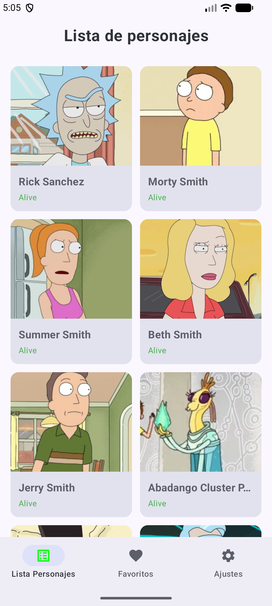 | 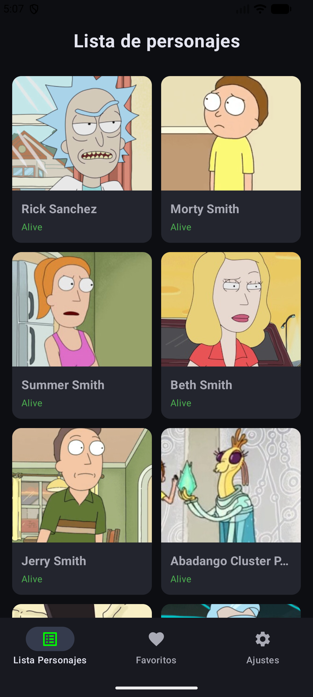 | 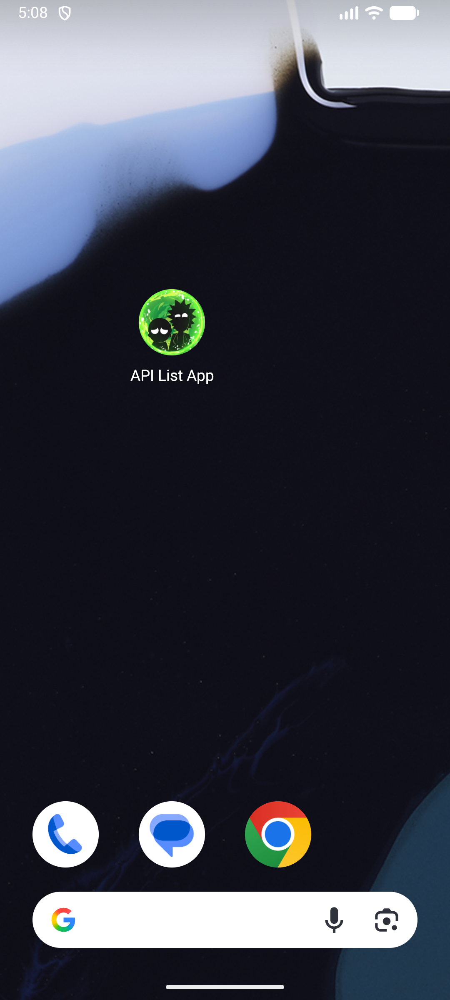 |

### Detalle del Personaje
Visualización detallada de la información y la funcionalidad para marcar como favorito.

| Detalle Estándar | Acción de Favorito |
| :---: | :---: |
| 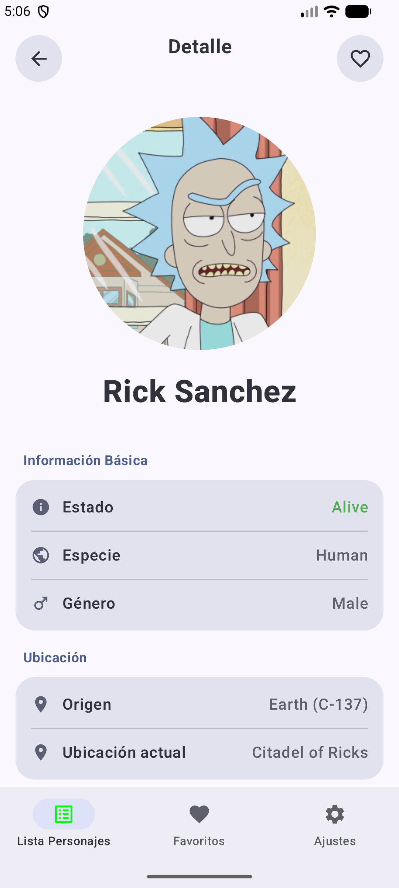 | 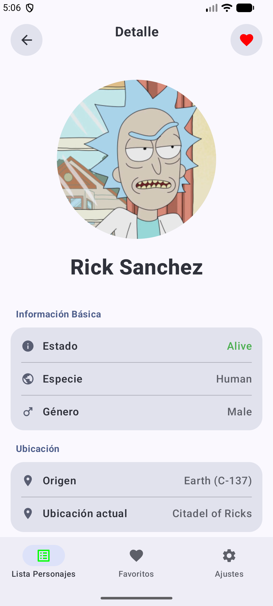 |

### Sección de Favoritos
Gestión de la persistencia de datos local y estados vacíos.

| Lista de Favoritos | Estado sin Datos | Confirmación de Borrado |
| :---: | :---: | :---: |
| 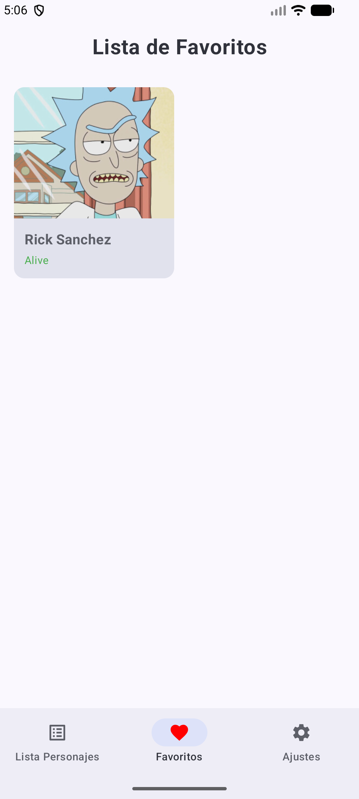 | 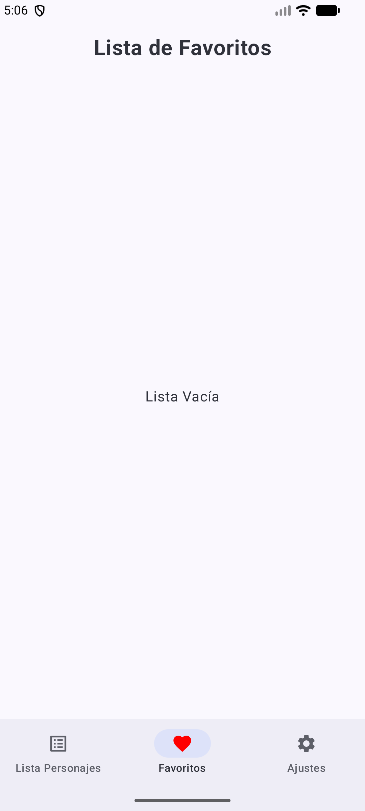 | 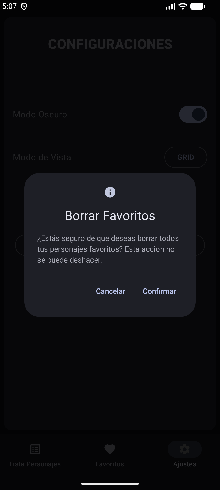 |

### Personalización y Ajustes
La aplicación permite configurar la experiencia visual según las preferencias del usuario.

| Panel de Ajustes | Modo Oscuro Aplicado | Detalle en Modo Oscuro |
| :---: | :---: | :---: |
| 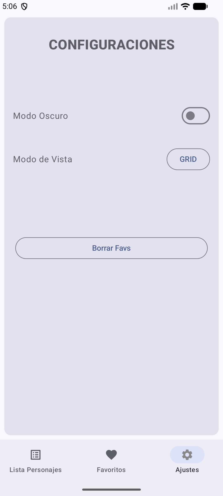 | 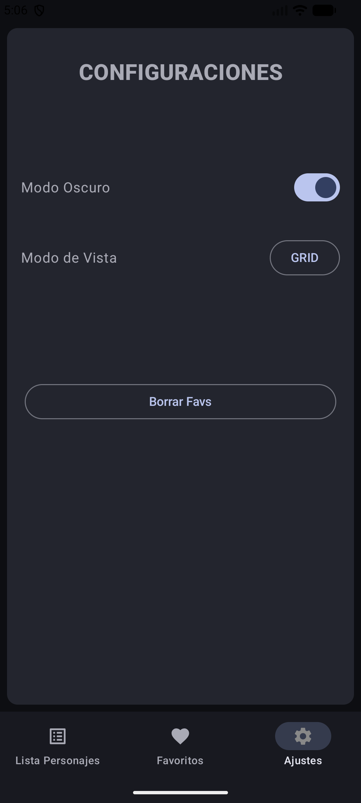 | 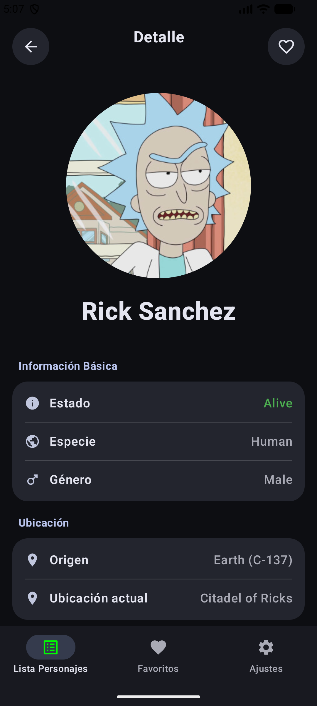 |

---

## 🛠️ Tecnologías utilizadas

* **Lenguaje:** [Kotlin](https://kotlinlang.org/)
* **UI Framework:** [Jetpack Compose](https://developer.android.com/jetpack/compose)
* **Entorno de Desarrollo:** Android Studio
* **Base de Datos:** Room / SQLite (Persistencia local)
* **Networking:** Retrofit / Ktor (Consumo de API)
* **Arquitectura:** MVVM (Model-View-ViewModel)

---

##  Instalación y Uso

1.  Clona este repositorio:
    ```bash
    git clone [https://github.com/elvinpoma/API-List-App.git](https://github.com/elvinpoma/API-List-App.git)
    ```
2.  Abre el proyecto en **Android Studio**.
3.  Sincroniza el proyecto con los archivos de Gradle.
4.  Ejecuta la aplicación en un emulador o dispositivo físico.
